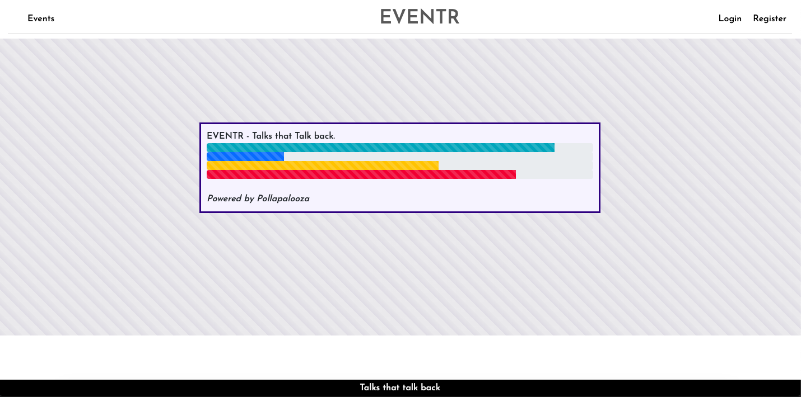

# ga-final-project

# EVENTR

## https://eventr-django-ga.herokuapp.com/

Log in to experience the full functionality of the site:

email: bantam@gmail.com

password: pass

## Overview
My team from project 3 decided to work again on this project following the successful productivity we had. Whereas our full stack app before was written in React JS and using MongoDB, we were now tasked with doing another full stack app this time using Python and Django in the backend, React/ React Hooks in the front end.
Wanting to create something that would be a level above what we achieved before and doing this while building it with Python and Django, which we had only learned for a week was a fun challenge. We also decided to focus on mobile first design.

We followed the same pattern as before in our last project; 
- Worked together as a team pseudo coding out the relationships between the models as this was a top priority. We wanted to make sure our plan was as solid as can be before moving onto the next stage of development
- Created wireframes in which we all agreed upon in terms of looks and functionality of components
- Divided the workload and communicated throughout the week to ensure harmony between our work. Communication being that we all started work at the same time and spent our work hours in a zoom room, accessible to each other throughout the day if and when need be. Organising our breaks on a daily basis. Always open shared when we were moving onto another part of the app to make sure it let others know if it was going to affect them

-----------------

# Project Brief:
- Build a full-stack application by making your own backend and your own front-end
- Use a Python Django API using Django REST Framework to serve your data from a Postgres database.
- Consume your API with a separate front-end built with React
- Be a complete product which most likely means multiple relationships and CRUD functionality for at least a couple of models.
- Implement thoughtful user stories/wireframes that are significant enough to help you know which features are core MVP and which you can cut.
- Have a visually impressive design.
- Be deployed online so it's publicly accessible.
- React Hooks** is optional for this project

-----------------

## Technologies used
# Backend:
- Python
- Django
- Psycopg2-binary
- Pylint
- Autopep8
- Djangorestframework
- Pyjwt
- Django-heroku

# Frontend:
- React
- React Hooks
- Axios
- Bootstrap
- Eslint-plugin-react
- Http-proxy-middleware
- Node-sass
- React-bootstrap
- React-dom
- React-hooks-bar-chart
- React-loader-spinner
- React-notify-toast
- React-router-dom
- React-select

# Development Tools:
- VS Code Editor
- GitHub
- Git
- Insomnia
- Quickdatabasediagrams.com
- TablePlus
- Chrome Dev Tools
- Heroku

-----------------

# Backend

My colleague and I again worked together to work out what models were needed. What fields they were going to have. What relationship they would have to each other; many to many/one to many/ pk field for e.g.
We did this using Quickdatabasediagrams.com which was an awesome tool to create a visual template which we could refer back to at any time. Once we were happy with our initial plan, we both started to create the models, keeping clear when we finished on one model and were moving onto another. We would occasionally talk out the serializers if one of us were stuck. Working in tandem like this was once again a great experience in productive teamwork.

*Models:*

- We had several models that had multiple relationships with other models. For example; our Basket model had 4 fields in total: 
1. The total price which was a decimal field.
2. Summary, which was a character field.
3. User (the owner of the basket), which was a foreign key field. This meant that we could create a basket that is only attached to that one user.
4. Our app sold tickets to talks. So, our fourth field was a many to many relationship for the talks. Meaning the basket could hold more than one talk, and the talk could be in many baskets.

*Serializers:*
- Once the models were complete, I moved onto serializers to so that data sent in the HTTP request would easily be rendered into JSON.
- We wanted our basket to show the talk name and users username, so I imported the 'get_user_model' from Django and used this to first create a User serializer. I then imported the basket model to be able to create the serializer for it, including all its fields.
- After this I also imported the Talk serializer. The final serializer was a basket serializer that was populated with its on data and also the user field and talk field. I did this by passing the basic basket serializer to this one and using the imported 'get_user_model' and Talk serializer to populate these two fields. Talk being set to '(many=true)'.

*Views:*
- Once happy with the serializers I moved onto the views to set up the necessary CRUD requests. Starting with a GET request to get all baskets, this was for testing purposes only as I moved onto Insomnia to test out the requests. I used the basic basket serializer to convert the data sent back into something readable.

- I then created a POST request. For this, I posted to the same view as get all baskets and used the same basic serializer. I used Pythons in built '.is_valid()' to validate the new basket and '.save()' to save it if it were. Using status from the rest framework, I worked in some error handling so that if the basket is not valid the response would send 422-Unprocessable Entity, along with the errors.

- I then moved onto creating a view for single baskets (which apart from posting a basket to the above view, would be the only ones the users use.) Using the frame works inbuilt 'Is Authenticated or Read Only' permission, I used this to make sure that only the user of that basket has access to it. I did this by using the primary key to look through all the baskets and get the associated one. I then ran a check to see if the basket user id matched the user id of the one requesting. If it didn’t, I raised permission denied.

- If it is the user’s basket, they are now able to GET their own basket, for which I used the populated basket serializer.

- The PUT request also took advantage of using the in built '.is_valid()' and '.save()' to check the adjustments are valid.

- Lastly I created the DELETE request. Where I found the basket using the primary key and ran a check to make sure it belongs to the user before allowing them to delete it.

*URL:*
Here I imported the views and set them to 'as._view()' on certian path endpoints.

When all of this had been done for all our models we also then registered them in our Installed Apps in project settings. The order in which they are listed is important as if one model depends on the existence of another, that one must be created first. In project URL we used 'include' to hook up the models URL to their correct path. So for example, ' path('api/categories/', include('categories.urls')) '. Now, anything after 'categories/' will be using the category urls. We put 'api/' before our backend requests as we will be using these same paths on the front end but needed a way to differentiate between them.

# Frontend
As before, my colleague had already scaffolded out the front end, and so we set about connecting everything up using a proxy-middleware. We then tested all of our models relationships. Going back and making adjustments to the backend was necessary a handful of times to make little tweaks that would fix the way the models interacted with each other.

# Bugs
At the end of our project no more bugs came to light.

# Hurdles
The most common tweak that was needed was having to correct which fields were populated on the front end in the response that came through. A couple of times we were stuck only getting the id of a talk or category and needed to amend the model and/or serializer to correct this. For example, at first,  talk only showed the ID initially on the GET request for the users basket.

To fix this we created a Populated Basket Serializer in which we imported the Talk serializer and used it to fetch the corresponding talk to that ID.

# Wins
Working with the same team again where we performed well before, it was a great sense of achievement to do the same again but also taking our app one step further by adding in our own unique functionality to the app. Creating the polls from scratch which the users can vote on was an awesome win.

# Final Product

We were quite happy with our unique poll feature and decided to use it on our homepage.

After logging in the user is forwarded to the talk index page where they can search through various filters.

The mobile version of the index page.

An example of a talk show page.

Users are able to comment on the talk.

Purchasing the ticket after putting it in the basket.

The unique QR code generated for each ticket.

Example of a users profile.

How a user can edit their profile.

Once a user has bought a ticket to a talk, they are now able to access any polls that have been created for that talk, vote and see the immediate result.

# Future Content & Improvements
- A notable improvement in the polls feature to be able that will analyse the voter’s stats and return the data. For example, if 60% of people voted for B, the app will then break down the stats of the voters into the fields they filled out in signing up (age, gender, industry, ethnicity). This is will give depth and texture to talks in being able to instantly on the spot ask the audience questions and receive analytics straight away, which is also fed back to the audience too.
- At the moment I have a toast pop up notification when a ticket is added the basket. I would like to replicate this for when a ticket is purchased, however, as upon purchasing the page is forwarded elsewhere the pop up is skipped.
- To style the desktop view in a more user friendly way.
